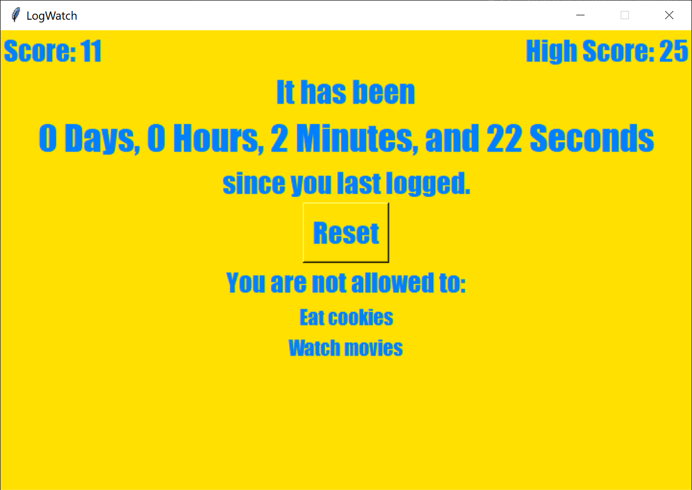

# LogWatch - A Productivity Timer Application



LogWatch is a Python-based productivity timer that helps you track time between specific activities (like logging into a system or completing tasks). It features a persistent timer, scoring system, and optional privilege restrictions to encourage discipline.

## Features

- ⏱️ **Persistent Timer**: Counts up continuously, even when the program isn't running
- 🔄 **Reset Button**: Manual reset with timestamp recording
- 📅 **Automatic Logging**: Records exact dates and times of each reset
- 🏆 **Scoring System**: 
  - Current score calculated as square root of seconds since last reset
  - High score tracking for motivation
- 🚫 **Optional Privilege System**:
  - Define activities to restrict (like phone use or gaming)
  - Restrictions automatically adjust based on your score/high score ratio
- 🎨 **Dynamic Visual Feedback**: Color changes from red to green as you approach your high score

## Requirements

- Python 3.6 or later

## Installation

1. Clone or download this repository
2. Install Python from [python.org](https://www.python.org/downloads/)

## Usage

1. **First Run**: The program will create an `info.txt` file to store your data
2. **Normal Operation**:
   - The timer will automatically start counting
   - Your score and high score will be displayed
   - The background color will change based on your progress
3. **Reset**: Click the "Reset" button when you complete the activity you're tracking
4. **Privileges**: Edit `info.txt` to add restrictions under "======Privileges======" section

### Customizing Privileges

To add personal restrictions:
1. Open `info.txt`
2. Under "======Privileges======", add one restriction per line
3. Examples:
   ```
   Use social media
   Play video games
   Eat junk food
   ```
4. Save the file - restrictions will appear on next run

#### Example Privileges

- Using your phone
- Playing video games
- Drinking alcohol/soda
- Eating junk food
- Social media browsing
- Any other habit you want to control

### Technical Details

- **Dependencies**: 
  - tkinter (included with Python)
  - datetime (standard library)
  - time (standard library)
- **Data Storage**: All information saved in `info.txt` in the script's directory
- **Scoring**: `score = √(seconds_since_last_reset)`

## Credits

Alex Akoopie - Creator
